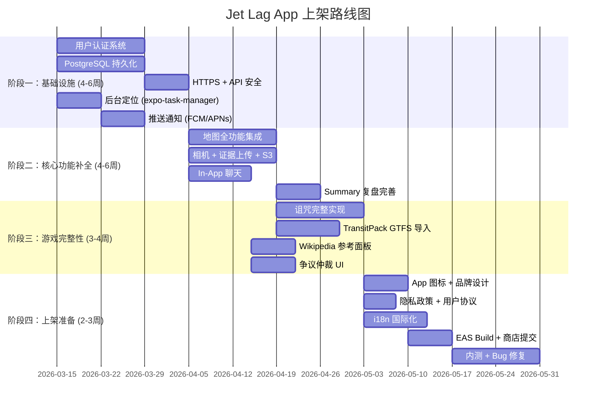

# Jet Lag App — 上架前差距分析报告

> 对照 PRD v2 / PRD v3 / SPEC v3 文档要求，分析当前实现的缺失项，按优先级分层整理。
> 重点方向：**以手机端为主的可上架产品**。

---

## 🔴 P0：上架必备 — 当前完全缺失

以下功能在 docs 中明确要求，且对上架商店来说属于**硬性必备**。

### 1. 用户认证 & 账号系统
| 现状 | 要求 |
|---|---|
| ❌ 完全无 auth | 房间加入仅靠 playerId 字符串传参，无登录/注册 |

- 需要：注册/登录（手机号/邮箱/第三方OAuth）、JWT/Session 鉴权、个人资料
- 上架原因：商店审核要求有用户管理能力；否则无法做数据持久化和账号安全

### 2. 持久化数据库
| 现状 | 要求（SPEC v3 §3） |
|---|---|
| ❌ 纯内存存储 (`game/store.js`) | PostgreSQL（元数据）+ S3/兼容存储（证据文件） |

- 当前所有房间/玩家/事件日志都存在 Node.js 内存中，服务重启即丢失
- 上架产品必须：房间持久化、历史记录、用户数据、跨设备恢复

### 3. In-App 聊天系统
| 现状 | 要求（PRD v3 §2 / PRD v2 §4.4） |
|---|---|
| ❌ 完全缺失 | "官方提问"走结构化组件 + 自由聊天可选开启 |

- 移动端和 Web 端均无房间内聊天 UI
- 需要：实时文本消息、消息历史、可能的语音通信

### 4. In-App 相机 & 证据上传
| 现状 | 要求（PRD v3 §2 / PRD v2 §4.5/AC-03） |
|---|---|
| ❌ 后端仅有 `evidence/upload-init` 和 `evidence/complete` 路由骨架 | 拍照类题目必须通过 App 相机拍摄；证据统一存储与回放 |

- 移动端无 `expo-camera` 或 `expo-image-picker` 集成
- 无对象存储后端（S3）、无证据文件管理
- Photo 类题目（PRD v2 §5.5 共 14 种拍照任务）完全不可用

### 5. 实际地图集成（移动端）
| 现状 | 要求（PRD v3 §8 / PRD v2 §4.2） |
|---|---|
| ⚠️ 有 `react-native-maps` 依赖但地图功能极度简陋 | 内置 MapProvider：瓦片地图 + POI 搜索 + 测距 + 绘图标注 + 路径规划 |

当前缺失的地图子功能：
- ❌ 游戏边界多边形绘制
- ❌ 实际瓦片地图渲染与 Provider 切换（Google/Mapbox/高德）
- ❌ 绘图图层（点/线/面/圆/多边形圈选）
- ❌ 距离测量工具
- ❌ Seeker 地图标注的共享图层
- ❌ 终局可视化（躲藏区高亮 + 最终躲藏点标记）

### 6. 推送通知
| 现状 | 要求 |
|---|---|
| ❌ 完全缺失 | 游戏状态变更、被提问、被抓捕、诅咒施放等关键事件需要推送 |

- 移动端产品必须有前台/后台推送能力
- 需要：`expo-notifications` + 云端推送服务（FCM/APNs）

### 7. 后台定位上报
| 现状 | 要求（PRD v2 §4.3 / PRD v3 §2） |
|---|---|
| ⚠️ 有 `expo-location` 依赖 | 寻找者必须持续共享定位；需要后台定位能力 |

- 当前仅有前台级定位采样
- 上架需要：后台定位任务（`expo-task-manager` + `expo-location` background）
- iOS/Android 后台定位权限申请与审核说明

---

## 🟠 P1：产品完整性 — 功能骨架存在但不完善

### 8. TransitPack GTFS 实际导入
| 现状 | 要求（PRD v3 §9 / SPEC v3 §9） |
|---|---|
| ⚠️ 后端有 `transitPack.js` 骨架和 `/transit/packs/import` 路由 | 支持 GTFS 标准文件解析、站点/线路索引、离线可用 |

- 无实际 GTFS 解析器（`stops.txt`, `routes.txt`, `stop_times.txt`）
- 移动端 Lobby 中无 TransitPack 选择/导入 UI

### 9. In-App 参考面板（Wikipedia / 行政区查询）
| 现状 | 要求（PRD v3 §8.3） |
|---|---|
| ❌ 完全缺失 | Wikipedia API 集成 + 行政区层级映射查询 + 引用快照共享 |

- 官方要求不让玩家出去查 Wikipedia
- 需要内嵌 WebView 或 API 查询面板

### 10. 完整诅咒系统实现
| 现状 | 要求（PRD v2 §8.3-8.5 共 30+ 张诅咒） |
|---|---|
| ⚠️ 后端有诅咒框架和 `circle_only` 等 | 每张诅咒的独立逻辑（解除条件、证据提交、计时、掷骰联动） |

差距：
- 大部分诅咒仅为数据定义，缺少具体的游戏逻辑实现
- 诅咒证据流程（相机拍摄→证据接收→躲藏者确认/仲裁）完全缺失
- 诅咒与提问/移动/抽牌的联动效果大部分未实现

### 11. 争议仲裁投票 UI
| 现状 | 要求（PRD v2 §7 / PRD v3 §2） |
|---|---|
| ⚠️ 后端有 `/disputes` 和 `/disputes/:id/vote` 路由 | 完整投票 UI + 结果锁定 + 房间内固定 |

- 移动端无仲裁投票界面
- 需要：争议发起→投票→结果展示的完整 UI 流程

### 12. Summary / 回合复盘屏
| 现状 | 要求（PRD v2 §4.8 / PRD v3 §10） |
|---|---|
| ⚠️ 有 `SummaryScreen.tsx` (1.3KB) 骨架 | 时间线回放、问答记录、卡牌与诅咒历史、路线回放 |

- 当前 Summary 界面极其简陋
- 需要：轨迹回放、问答时间线、卡牌使用历史、得分明细

---

## 🟡 P2：体验增强 — 上架后迭代

### 13. 安全与体验功能
- ❌ 夜间/疲劳提醒（Large 游戏）
- ❌ 安全提示（边界外/危险区域提醒）
- ❌ 紧急联系人共享位置（非游戏内）
- ❌ 休息时段自动暂停

### 14. 离线模式优化
- ❌ 断网续玩能力
- ❌ 本地缓存 + 重连同步
- ❌ TransitPack 离线数据

### 15. 多局统计仪表盘
- ❌ 跨回合/跨房间的综合统计（最长单局、平均提问数等）
- ❌ 玩家历史战绩

### 16. 扩展包全部卡牌配置化
- ⚠️ 部分 MVP 道具已实现
- ❌ Expansion Pack Volume 1 所有新增诅咒的逻辑实现
- ❌ 卡牌组合/扩展包开关配置 UI

### 17. 几何推理辅助工具
- ❌ Radar 回答后自动生成圆形可行区域
- ❌ Thermometer 回答后自动生成半平面/环形约束
- ❌ 多次回答的几何交叉可视化

### 18. Referee Web 端
- ❌ 独立裁判面板（Observer 角色的专用 Web 界面）

---

## 📱 上架商城额外必备（非功能性）

以下不在 PRD 中列出，但作为上架 iOS App Store / Google Play **基本要求**：

| 项目 | 现状 | 所需 |
|---|---|---|
| **App 图标 & 启动画面** | ❌ 无 | 品牌设计 + 各分辨率适配 |
| **隐私政策 & 用户协议** | ❌ 无 | 法律文本 + App 内展示 |
| **国际化 (i18n)** | ⚠️ 部分中文硬编码 | 中/英双语支持框架 |
| **App 签名 & 证书** | ❌ 无 | iOS 证书 / Android 签名 keystore |
| **Expo → EAS Build** | ❌ 未配置 | 配置 EAS Build + 商店提交流程 |
| **错误监控 (Sentry/Crashlytics)** | ❌ 无 | 线上崩溃追踪 |
| **性能优化** | ⚠️ | SeekingScreen 42KB 单文件需拆分 |
| **无障碍 (Accessibility)** | ❌ 无 | 屏幕阅读器、字体缩放支持 |
| **深色模式** | ❌ 未知 | iOS/Android 系统深色模式适配 |
| **启动引导 / 教程** | ❌ 无 | 新用户游戏规则引导 |
| **网络状态处理** | ❌ 不完善 | 断网提示、重连机制、loading 态 |
| **API 安全 (Rate Limit / HTTPS)** | ❌ 纯 HTTP | HTTPS + API 限流 + 输入校验 |

---

## 📊 建议实施路线图

---

## ✅ 已实现且达标的部分（无需大改）

以下功能已经**较好地满足** docs 要求：

- ✅ 房间管理（创建/加入/离开/准备/开始）
- ✅ 完整回合状态机（Lobby→Hide→Seek→EndGame→Caught→Summary→NextRound）
- ✅ 服务端计时器驱动的阶段转换
- ✅ 角色系统与信息差投影（Hider/Seeker/Observer）
- ✅ 结构化提问管道（串行锁 + 类别时间限制 + 冷却 + 重复倍增）
- ✅ 抽牌/手牌管理（上限 6、超限弃置、保留选择）
- ✅ MVP 道具（Veto、Randomize、Discard N Draw M、Expand Hand Size）
- ✅ 骰子系统（服务端随机 + 防重放哈希）
- ✅ 抓捕判定（距离模式 + 视觉确认）
- ✅ 暂停/恢复 + 基础争议后端
- ✅ WebSocket 实时通信 + 事件日志 + 哈希链
- ✅ 基础反作弊（速度异常检测）
- ✅ 前端能力投影（按钮锁定）
- ✅ MapProviderAdapter 接口骨架
- ✅ POI 合法性判定（review_count ≥ 5）
- ✅ CORS + LAN 调试支持
